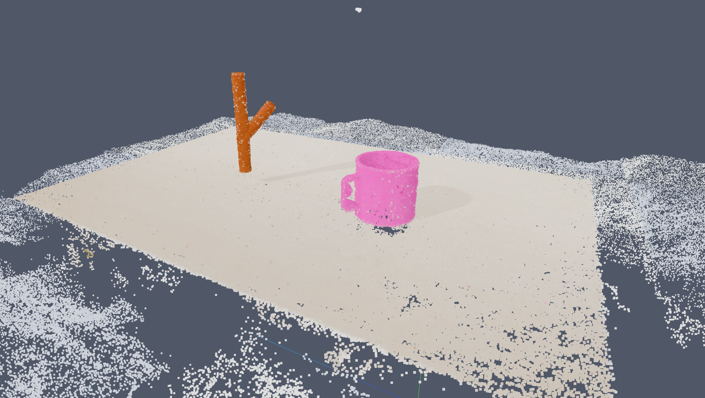

# Relational Neural Descriptor Fields (R-NDF)
This is a modified implementation of R-NDF with some additional features, including

- Capturing a dataset for training a NeRF
  - By default we capture 36 views around the center of the table.
  - You can modify the configuration in [src/rndf_robot/config/default_nerf_cfg.py](src/rndf_robot/config/default_nerf_cfg.py)
- CPU-only support
  - You can evaluate R-NDF on CPU (e.g. M1 Mac). No configuration are special flags needed.
  - Note that the evaluation is super slow on CPU, you may want to adjust the `--opt-iterations` flag.
- Minor improved functionality for PyBullet including:
  - Loading textures/colors randomly for the objects and table
  - By default disabling the debug visualizer which slows things down

Please see [OG_README.md](OG_README.md) for the original README file. The installation instructions are all there.
There may be other hacks you will need to do to get this version of the codebase working.

<!-- Align image in center and have caption -->
<p align="center">
    
    <br>
    <i>Point Cloud from a NeRF of a scene in R-NDF.</i>
</p>

### Table of Contents
- [Setup and Installation](OG_README.md#setup) (note this links to the original README)
- [NeRF Dataset Format](#NeRF Dataset Format)
- [Unit Tests](#Unit Tests)
- [General Tips](#General Tips)
- [Acknowledgements](#Acknowledgements)

___

## NeRF Dataset Format
The NeRF datasets are written in the [instant-ngp](https://github.com/NVlabs/instant-ngp/) `transforms.json` format.
As a result, they are immediately compatible with [instant-ngp](https://github.com/NVlabs/instant-ngp/) and 
[nerfstudio](https://github.com/nerfstudio-project/nerfstudio/).
For nerfstudio, you can use either the `nerfstudio-data` or `instant-ngp` data parser.


We automatically compute the center of attention and a scale so the transforms are within the
unit cube. You may need to find tune the scale further based on your NeRF implementation.

### Dataset Structure
We create the following dataset for each trial in the `evaluate_relations_multi_ndf.py` script:
```bash
nerf_dataset/
    depths/
    rgbs/
    normalization_params.json
    transforms.json
    transforms_unnormalized.json
```

- `depths/` contains the depth maps for each frame. The depth maps are stored as `uint16` PNGs.
- `rgbs/` contains the RGB images for each frame. The RGB images are stored as `uint8` PNGs.
- `normalization_params.json` contains the normalization parameters for the dataset (i.e., translation and scale)
  - Check [src/rndf_robot/nerf/dataset.py](src/rndf_robot/nerf/dataset.py) for details on how this is applied
    and how to reverse the normalization.
- `transforms.json` contains the normalized camera poses and intrinsics in `instant-ngp` format.
- `transforms_unnormalized.json` contains the unnormalized camera poses and intrinsics in `instant-ngp` format.

**Note:** you can disable the NeRF dataset generation using the `--disable_nerf_cams` in 
the `evaluate_relations_multi_ndf.py` script.

## Unit Tests
There are some pytest unit tests in the `tests` directory to test the added NeRF functionality.
You can run them with:

```bash
pytest tests
```

The tests are not comprehensive and were just for checking sanity and no obvious mistakes.

## General Tips
When running the `evaluate_relations_multi_ndf.py` script, the following flags might be helpful.

### Loading the demonstration scenes
This is useful if you want to use the pre-recorded demonstrations for other use-cases.

Use the `demo_pose` pose type to use the poses specified in the demonstrations, and the `--test_on_train` flag
to force the usage of the objects used in the demonstrations.

```bash
--parent_load_pose_type demo_pose --child_load_pose_type demo_pose --test_on_train
```

### Skipping R-NDF Optimization
```bash
--skip_opt
```

### Setting the Plane and Background Color in PyBullet
Use the `--help` flag to see the full details, but here's an example.

```bash
--plane-texture plane --pybullet_background_color white
```

### The script is hanging?
You probably need to start MeshCat and then restart whatever script you are running.

```bash
meshcat-server
```

## Acknowledgements
We thank Anthony Simeonov and the original authors of the R-NDF codebase for making their code available 
and for their extensive help.
